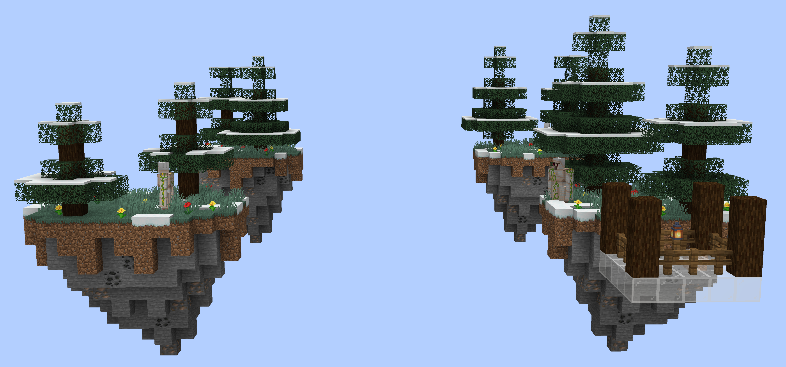
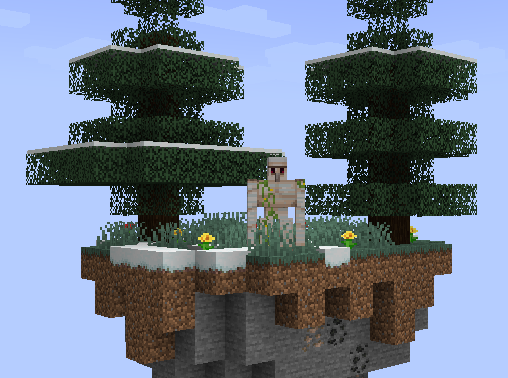

# Bedwars Snowy Taiga

> A snowy-taiga-themed map for my [Bedwars plugin](https://github.com/esotericenderman/bedwars).

## License

  &copy; 2024-2025 <a rel="cc:attributionURL dct:creator" property="cc:attributionName" href="https://enderman.dev">Esoteric Enderman</a>

  <a property="dct:title" rel="cc:attributionURL" href="https://github.com/esotericenderman/bedwars-snowy-taiga">Bedwars Snowy Taiga</a> is licensed under <a href="https://github.com/esotericenderman/bedwars-snowy-taiga/blob/main/LICENSE" target="_blank" rel="license noopener noreferrer" property="cc:license" style="display: inline-block">CC BY-SA 4.0</a>.

  

## Disclaimer

NOT AN OFFICIAL MINECRAFT PRODUCT. NOT APPROVED BY OR ASSOCIATED WITH MOJANG OR MICROSOFT.

## Topics

[minecraft](https://github.com/topics/minecraft), [minigames](https://github.com/topics/minigames), [minigame](https://github.com/topics/minigame), [minecraft-map](https://github.com/topics/minecraft-map), [minigame-plugin](https://github.com/topics/minigame-plugin), [minecraft-map-making](https://github.com/topics/minecraft-map-making), [minecraft-world](https://github.com/topics/minecraft-world), [minecraft-worlds](https://github.com/topics/minecraft-worlds), [minecraft-maps](https://github.com/topics/minecraft-maps)
