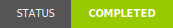

# Bedwars Snowy Taiga Map

> A snowy-taiga-themed map for my [Bedwars plugin](https://github.com/EsotericEnderman/bedwars-plugin).

## License

  <a property="dct:title" rel="cc:attributionURL" href="https://github.com/EsotericEnderman/bedwars-snowy-taiga-map">Bedwars Snowy Taiga Map</a> &copy; 2024 by <a rel="cc:attributionURL dct:creator" property="cc:attributionName" href="https://enderman.dev">Esoteric Enderman</a> is licensed under <a href="./LICENSE" target="_blank" rel="license noopener noreferrer" style="display: inline-block">CC BY-SA 4.0</a><a href="https://creativecommons.org/">.

## Topics

[minecraft](https://github.com/topics/minecraft), [minigames](https://github.com/topics/minigames), [minigame](https://github.com/topics/minigame), [minecraft-map](https://github.com/topics/minecraft-map), [minigame-plugin](https://github.com/topics/minigame-plugin), [minecraft-map-making](https://github.com/topics/minecraft-map-making), [minecraft-world](https://github.com/topics/minecraft-world), [minecraft-worlds](https://github.com/topics/minecraft-worlds), [minecraft-maps](https://github.com/topics/minecraft-maps)
